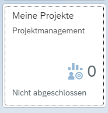
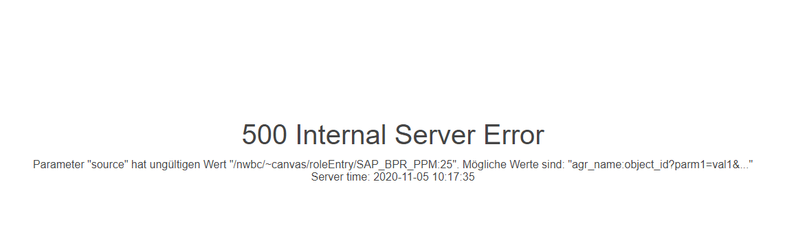

# List of Famous Errors

## Tile "My Projects" is not working

### Problem

Open Launchpad and click this tile:

and get this error:

### Solution

Add the role `SAP_BPR_PPM` to your user ([found here](https://answers.sap.com/questions/221707/uncaughtexception-cxnwbc-solution-manager-72-proje.html))

