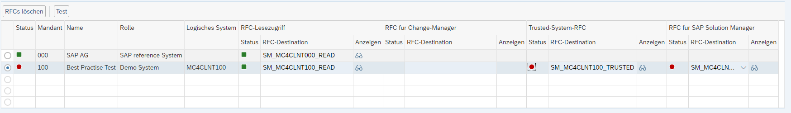

# SolDoc Activation

## Maintain managed Systems

Open Transaction `SOLMAN_SETUP` and select `Managed System Configuration`.

## Solution Administration

Add technical Systems to already defined logical components.

Click on `Assign Technical System | Technische System zuordnen` and Select `ERP` from dropdown.

Enter the correct Systems to Development, Production and so on, that the result looks as follows:

## Maintain RFC-Communication

Trying to jump into the managed System from Solution Documentations shows the following Error:

### LMDB

Call transaction `LMDB` or open this [URL](https://sapsms.cnsint.de:50001/sap/bc/webdynpro/sap/lmdb_wda_expl_oif?WDCONFIGURATIONID=LMDB_WDA_EXPL_OIF_CFG&sap-client=001&sap-language=DE#)

Open the configuration for MC4.

Click on `Maintain RFC`.

Select the connection to MC4CLNT100 and the the choose 'Create/Update SM_MC4CLNT100_TRUSTED* below. It can also be necessary to enter a user, who has to authorizations to execute the creation step.

Perhaps, the newly created connections will show errors - then we have to [maintain the trusted RFC-Authorizations in the managed system](#create-trusted-rfc-role-in-managed-system).

With the roles assigned, everything looks better :-)

### Create Trusted RFC-Role in Managed System

Go to transaction `PFCG` in managed system and create a role (i.e. *ZTRUSTED_SMS_100*) and add the Authorization Object *S_RFCACL* to it.

After creation of the role, be sure to active the profile, assign it to the users and to do a *Benutzerabgleich*.

